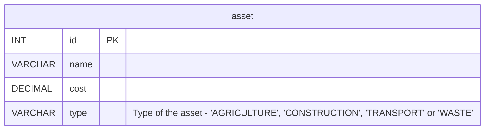

# Simply Asset Finance Coding Test

Welcome to the coding test for Simply Asset Finance. Please read the description below to find out more about the format
of the test, and the project that you'll be working with.

When you are ready to begin, make a fork of this repository (https://github.com/SimplyFinance/asset-recommender), make
any changes to the code as instructed and open a pull request pointing to `master` branch once you have completed the
test. Please include your name in the title of the PR.

Feel free to change anything you see fit about the project, including test data provided.

You can make use of any tools that you have at your disposal, including the internet.

This test is expected to take roughly 1 hour, though there is no strict time limits.

# Asset Recommendation System

This project is a system that holds information about assets, and provides a couple of endpoints to retrieve data about
them.

An asset is generally a piece of machinery or a vehicle.

It is a Spring Boot (2.5) project, built using Maven (3.8.2), with an embedded H2
database (https://www.javatpoint.com/spring-boot-h2-database) that contains a few sample assets.

## DB Structure

The database contains a single table, which has four fields:



The schema for this database is defined in `src/main/resources/schema.sql`, and some example records have been added,
defined in `src/main/resources/data.sql`, which will be persisted to DB on application startup.

The data from `data.sql` will also be available in the test suite provided.

## Maven

In order to build Spring Boot application, navigate to the base directory of the project (`asset-recommender`) and run:

`mvn clean install`

This will create a file called `asset-recommender.jar` in the `target` directory. This file can be run as usual, simply
by running:

`java -jar target/asset-recommender.jar`

Once the app is running, it will be available on `http://localhost:8080`, endpoints:

- `http://localhost:8080/api/asset?maxCost={maxCost}`
- `http://localhost:8080/api/asset/sum-for-types`

(If you have any issues building/running the application, there is a GitHub Actions workflow that will run the tests
in `AssetController`, which can be used to verify that your changes are working correctly. It will run once a PR has
been opened.)

## Task

The task is to implement two endpoints, which have definitions in the `AssetController`.

### 1.

`GET /api/asset?maxCost={maxCost}` should return a list of all assets that have a `cost` <strong>less than or equal
to</strong> the `maxCost` query param, ordered by `name` ascending.

The endpoint should return a 404 if no assets are found.

For example, if there are 3 assets in the database:

| id  | name    | cost      | type        |
|-----|---------|-----------|-------------|
| 1   | Tractor | 100,000   | AGRICULTURE |
| 2   | Ferry   | 1,500,000 | TRANSPORT   |
| 3   | Taxi    | 30,000    | TRANSPORT   |

then the expected response for request `/api/asset?maxCost=100000` would be:

```json
[
  {
    "id": 3,
    "name": "Taxi",
    "cost": 30000.0,
    "type": "TRANSPORT"
  },
  {
    "id": 1,
    "name": "Tractor",
    "cost": 100000.0,
    "type": "AGRICULTURE"
  }
]
```

### 2.

`GET /api/asset/sum-for-types` should return a map, with `Asset.Type` as keys, and the sum of costs of all assets of
that type as value. All types should be included in the response.

For example, with the same data as the previous example, the expected response for request `/api/asset/sum-for-types`
would be:

```json
{
  "AGRICULTURE": 100000.0,
  "CONSTRUCTION": 0.0,
  "TRANSPORT": 1530000.0,
  "WASTE": 0.0
}
```

Order of keys in the response is not important.

## JUnit Tests

There currently exists one test class in the project, `AssetControllerIT`, which contains a few simple tests to verify
that endpoints are working as expected. As the endpoints are not implemented yet, the tests will fail.

These are written using JUnit version 5.7.

All tests can be run with command: `mvn failsafe:integration-test`

Please feel free to make any changes to the tests that you wish, or add additional ones.